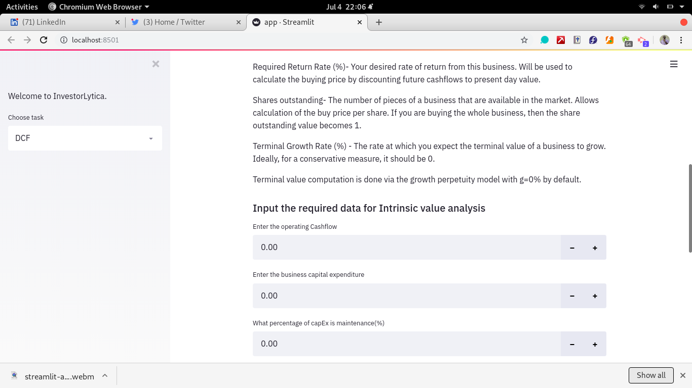
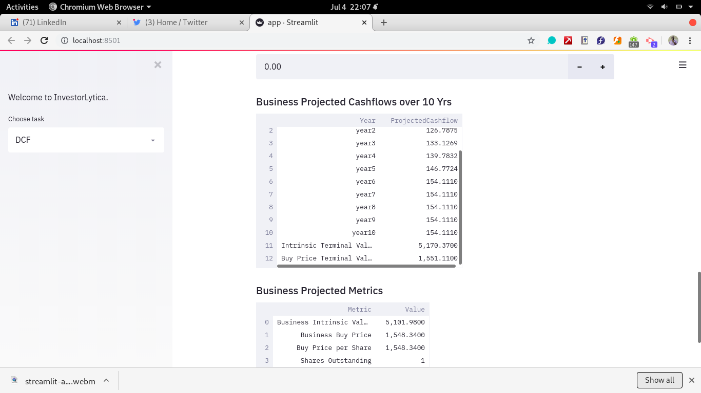
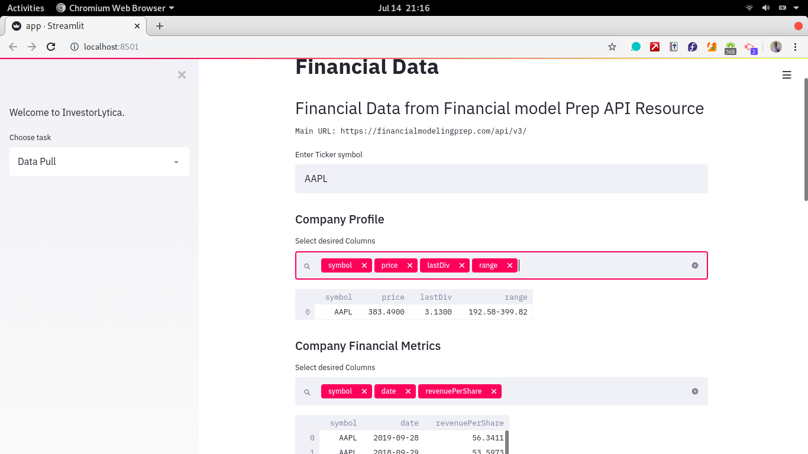
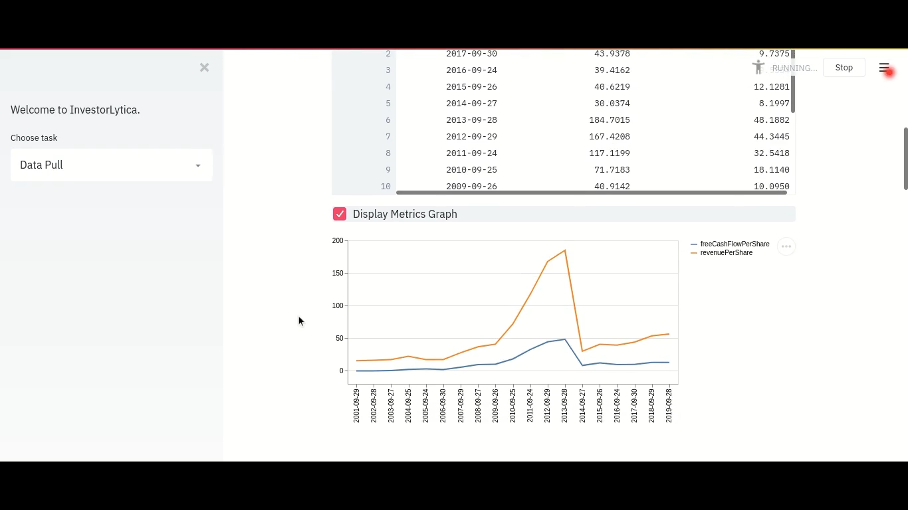
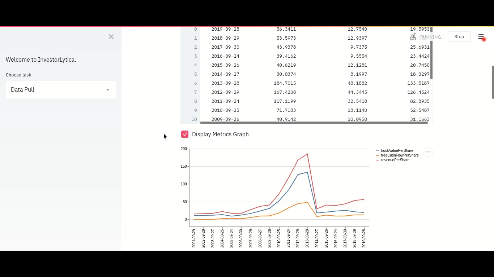
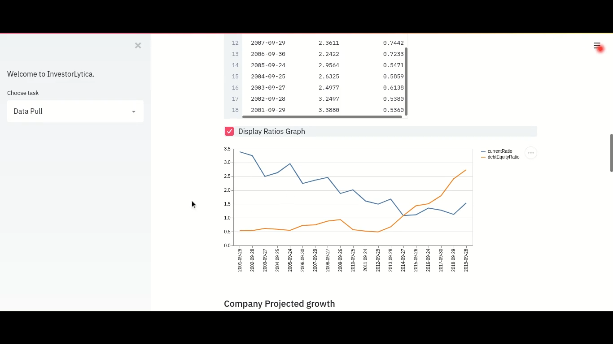

## pyFinance
All about the time value of money.
## Tech Stack
1. [streamlit]() for serving the app on the web
2. [Docker]() for containerization
3. [Financial Model Prep]() Financial data API

## Obtaining API Key
To run this project, you require an API key from [Financial model prep]()
After obtaining the key, paste it into the `API_KEY` variable in the `.env file.
## Spin up Docker image and run project
To build the docker image, navigate to your working directory and run the command

`docker build -f Dockerfile -t app:my_tag`

After a succesfful build, run the command

```docker run -p 8501:8501 app:my_tag```

## Screens
Sample screens from running of the app.
#### Manual Data Entry for DCF
This interface if for manually entering numbers and then performing the projected cashflows and performing **DCF Analysis**
 




#### API Pulled Data
Dynamic selection tool to choose columns from dataset

Viewing selected data in a table


Viewing selected data as an annotated line graph


Compare more than one entity using line graphs







## DCF Modeling
#### Logic and Formulas
**Dicsounted CashFlow** modelling can be viewed as reversed compound interest.
It is basically trying to determine the value of future cashflows of a business in current times using an appropriate **disocunt rate**
This helps an investor to determine whether an investment is worth pursuing. Read more [here](https://www.investopedia.com/terms/d/dcf.asp)
for indepth definition and formulas.